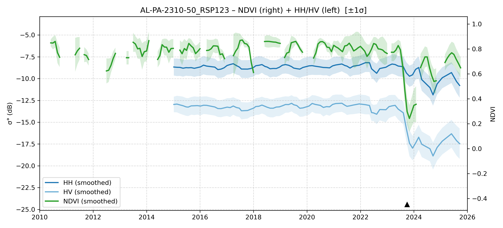

# AL-PA-2310-50 - FIeldSurvey_20231008-14_PA

| Title | Content |
|------|---------|
| ID | AL-PA-2310-50 |
| Survey Name | FIeldSurvey_20231008-14_PA |
| Mesh | S02W052 |
| State | PA |
| Lat, Lon | -51.85650604, -2.572422947 |
| Survey Date | 2023/10/10 |
| JJ-FAST v3.2 Date | 2021/11/9 |
| JJ-FAST v4.1 Date | 2021/9/28 |
| Deter Date | 2023/8/26 |
| Type | DES |
| NASA FIRMS Date |  |
| Prodes Year | 2024, 2023, 2022 |
| Embargo | N/A |
| Obs |  |

---

## Survey Results 

---

## Map & Graph

（静的地図画像はまだ登録されていません）

---

## Comments

- 調査時の所感
- 現場の状況（伐採形態、森林状態など）
- 補足情報
