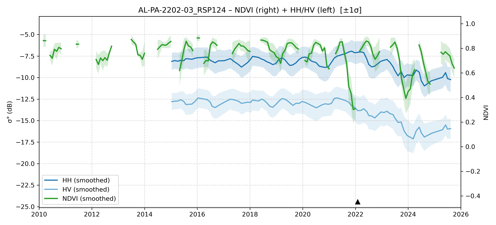

# AL-PA-2202-03 - FieldSurvey_20220214-21_PA

| Title | Content |
|------|---------|
| ID | AL-PA-2202-03 |
| Survey Name | FieldSurvey_20220214-21_PA |
| Mesh | S03W052 |
| State | PA |
| Lat, Lon | -51.75402197, -3.004204682 |
| Survey Date | 2022/2/16 |
| JJ-FAST v3.2 Date | 2021/9/23 |
| JJ-FAST v4.1 Date | N/A |
| Deter Date | 2021/10/3 |
| Type | DES |
| NASA FIRMS Date |  |
| Prodes Year | 2022 |
| Embargo | N/A |
| Obs |  |

---

## Survey Results 

---

## Map & Graph

（静的地図画像はまだ登録されていません）

---

## Comments

- 調査時の所感
- 現場の状況（伐採形態、森林状態など）
- 補足情報
