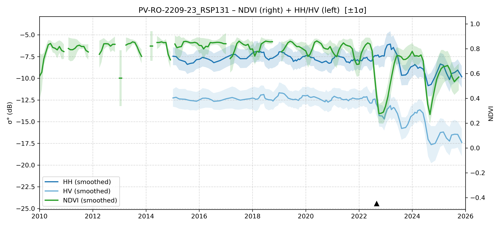

# PV-RO-2209-23 - FieldSurvey_20220919-23_RO

| Title | Content |
|------|---------|
| ID | PV-RO-2209-23 |
| Survey Name | FieldSurvey_20220919-23_RO |
| Mesh | S09W066 |
| State | RO |
| Lat, Lon | -65.88859777, -9.012480475 |
| Survey Date | 2022/9/18 |
| JJ-FAST v3.2 Date | 2021/11/7 |
| JJ-FAST v4.1 Date | 2021/9/21 |
| Deter Date | 2021/8/14 |
| Type | DES |
| NASA FIRMS Date |  |
| Prodes Year | 2022 |
| Embargo | 2022/10/8, 2023/6/1 |
| Obs |  |

---

## Survey Results 

---

## Map & Graph

（静的地図画像はまだ登録されていません）

---

## Comments

- 調査時の所感
- 現場の状況（伐採形態、森林状態など）
- 補足情報
