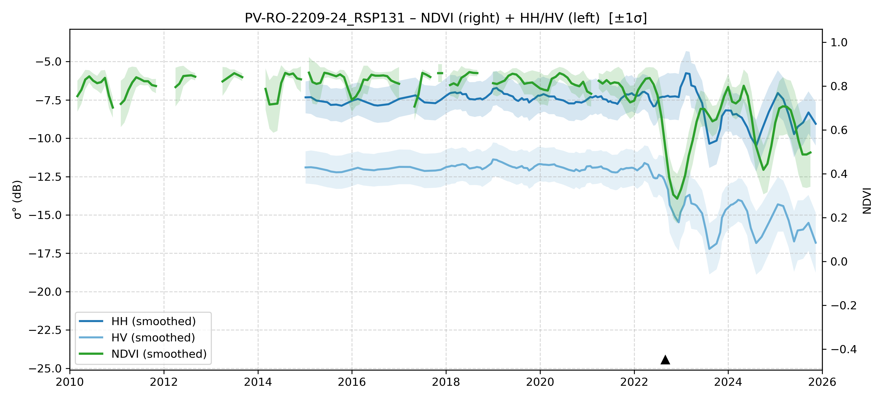

# PV-RO-2209-24 - FieldSurvey_20220919-23_RO

| Title | Content |
|------|---------|
| ID | PV-RO-2209-24 |
| Survey Name | FieldSurvey_20220919-23_RO |
| Mesh | S08W066 |
| State | RO |
| Lat, Lon | -65.92891997, -8.951062953 |
| Survey Date | 2022/9/18 |
| JJ-FAST v3.2 Date | 2022/8/14 |
| JJ-FAST v4.1 Date | 2022/6/14 |
| Deter Date | 2022/10/31 |
| Type | DEG |
| NASA FIRMS Date |  |
| Prodes Year | 2022, 2023 |
| Embargo | 2023/4/4 |
| Obs |  |

---

## Survey Results 

---

## Map & Graph

（静的地図画像はまだ登録されていません）

---

## Comments

- 調査時の所感
- 現場の状況（伐採形態、森林状態など）
- 補足情報
