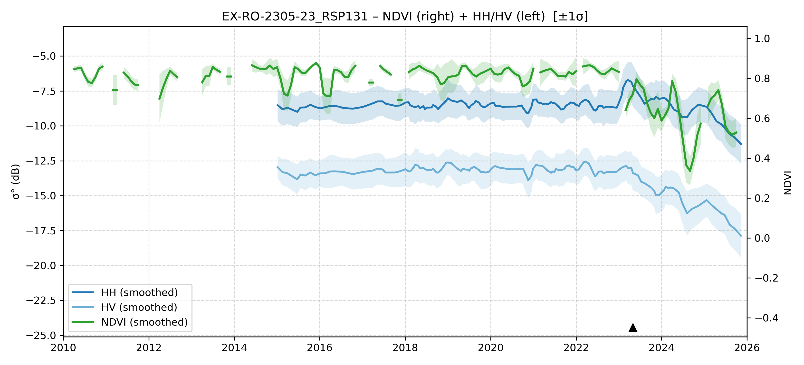

# EX-RO-2305-23 - FieldSurvey_20230525-0601_RO_AC

| Title | Content |
|------|---------|
| ID | EX-RO-2305-23 |
| Survey Name | FieldSurvey_20230525-0601_RO_AC |
| Mesh | S09W067 |
| State | RO |
| Lat, Lon | -66.84135751, -9.895573769 |
| Survey Date | 2023/5/31 |
| JJ-FAST v3.2 Date | 2023/2/7 |
| JJ-FAST v4.1 Date | 2023/1/24 |
| Deter Date | 2023/4/27 |
| Type | DES |
| NASA FIRMS Date |  |
| Prodes Year | 2024 |
| Embargo | N/A |
| Obs |  |

---

## Survey Results 

---

## Map & Graph

（静的地図画像はまだ登録されていません）

---

## Comments

- 調査時の所感
- 現場の状況（伐採形態、森林状態など）
- 補足情報
