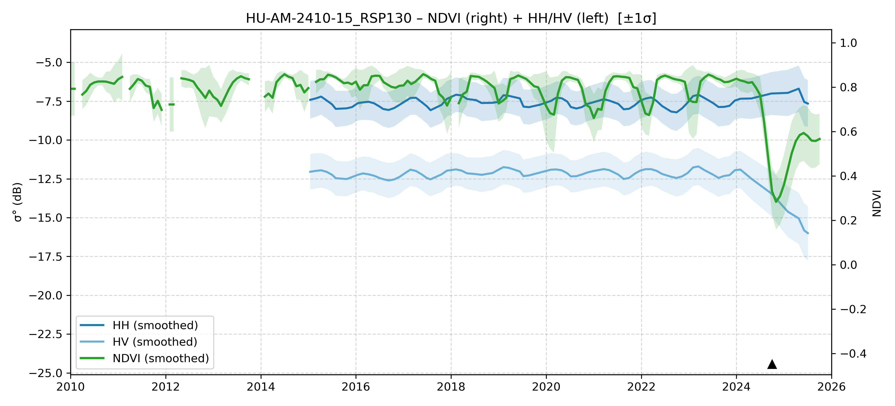

# HU-AM-2410-15 - FieldSurvey_20241007-11_RO_AM

| Title | Content |
|------|---------|
| ID | HU-AM-2410-15 |
| Survey Name | FieldSurvey_20241007-11_RO_AM |
| Mesh | S07W064 |
| State | AM |
| Lat, Lon | -63.87324139, -7.525606599 |
| Survey Date | 2024/10/9 |
| JJ-FAST v3.2 Date | 2020/9/3 |
| JJ-FAST v4.1 Date | 2017/11/30 |
| Deter Date | 2024/6/19 |
| Type | DES |
| NASA FIRMS Date |  |
| Prodes Year | 2024, Foerst, 2007 |
| Embargo | 2025/4/8 |
| Obs |  |

---

## Survey Results 

---

## Map & Graph

（静的地図画像はまだ登録されていません）

---

## Comments

- 調査時の所感
- 現場の状況（伐採形態、森林状態など）
- 補足情報
