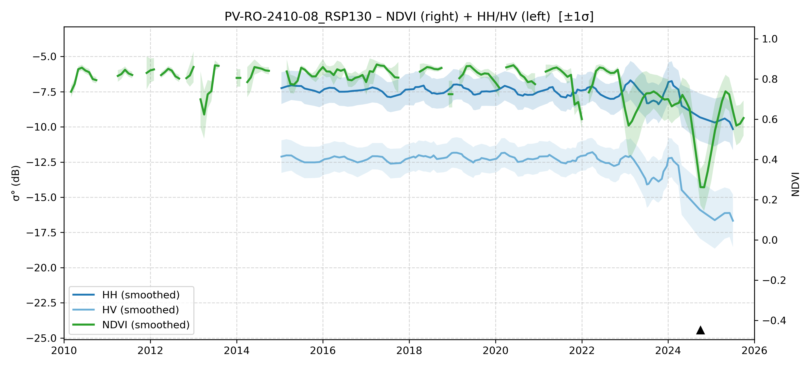

# PV-RO-2410-08 - FieldSurvey_20241007-11_RO_AM

| Title | Content |
|------|---------|
| ID | PV-RO-2410-08 |
| Survey Name | FieldSurvey_20241007-11_RO_AM |
| Mesh | S08W064 |
| State | RO |
| Lat, Lon | -63.33919352, -8.564849609 |
| Survey Date | 2024/10/10 |
| JJ-FAST v3.2 Date | 2020/10/15 |
| JJ-FAST v4.1 Date | N/A |
| Deter Date | 2023/1/8 |
| Type | DEG, QUE |
| NASA FIRMS Date |  |
| Prodes Year | 2023, 2024, Foerst |
| Embargo | 2023/5/12 |
| Obs |  |

---

## Survey Results 

---

## Map & Graph

（静的地図画像はまだ登録されていません）

---

## Comments

- 調査時の所感
- 現場の状況（伐採形態、森林状態など）
- 補足情報
