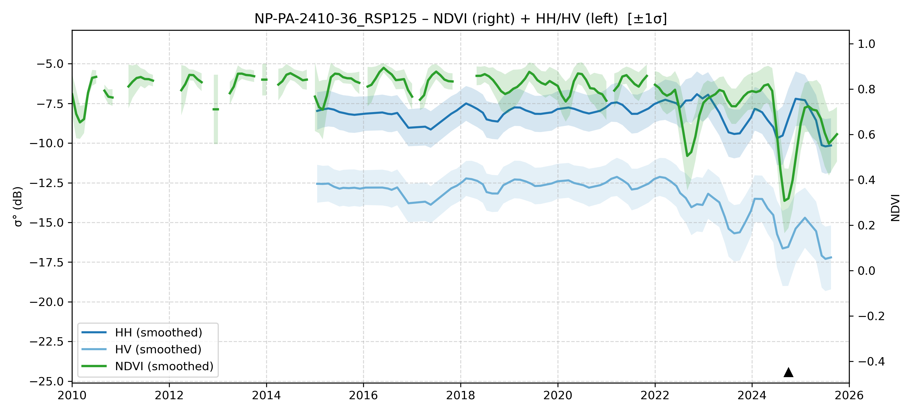

# NP-PA-2410-36 - FieldSurvey_20241023-27_PA

| Title | Content |
|------|---------|
| ID | NP-PA-2410-36 |
| Survey Name | FieldSurvey_20241023-27_PA |
| Mesh | S07W056 |
| State | PA |
| Lat, Lon | -55.10071349, -7.822596449 |
| Survey Date | 2024/10/26 |
| JJ-FAST v3.2 Date | 2021/6/13 |
| JJ-FAST v4.1 Date | 2020/11/15 |
| Deter Date | 2020/11/11 |
| Type | DEG |
| NASA FIRMS Date |  |
| Prodes Year | 2022, 2023 |
| Embargo | 2017/6/23, 2022/3/15, 2022/5/16 |
| Obs |  |

---

## Survey Results 

---

## Map & Graph

（静的地図画像はまだ登録されていません）

---

## Comments

- 調査時の所感
- 現場の状況（伐採形態、森林状態など）
- 補足情報
