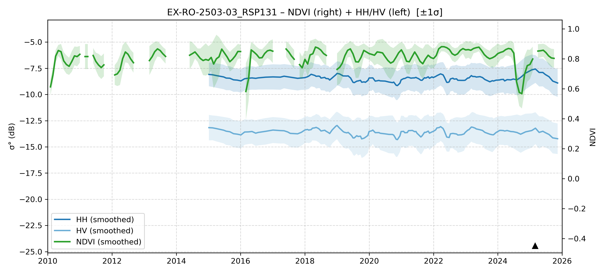

# EX-RO-2503-03 - FieldSurvey_20250309-15_RO_AC

| Title | Content |
|------|---------|
| ID | EX-RO-2503-03 |
| Survey Name | FieldSurvey_20250309-15_RO_AC |
| Mesh | S09W067 |
| State | RO |
| Lat, Lon | -66.43718683, -9.772030425 |
| Survey Date | 2025/3/11 |
| JJ-FAST v3.2 Date | 2023/10/8 |
| JJ-FAST v4.1 Date | 2024/11/12 |
| Deter Date | 2020/7/17 |
| Type | DES |
| NASA FIRMS Date |  |
| Prodes Year | Foerst, 2007, 2020 |
| Embargo | 2025/3/17 |
| Obs |  |

---

## Survey Results 

---

## Map & Graph

（静的地図画像はまだ登録されていません）

---

## Comments

- 調査時の所感
- 現場の状況（伐採形態、森林状態など）
- 補足情報
