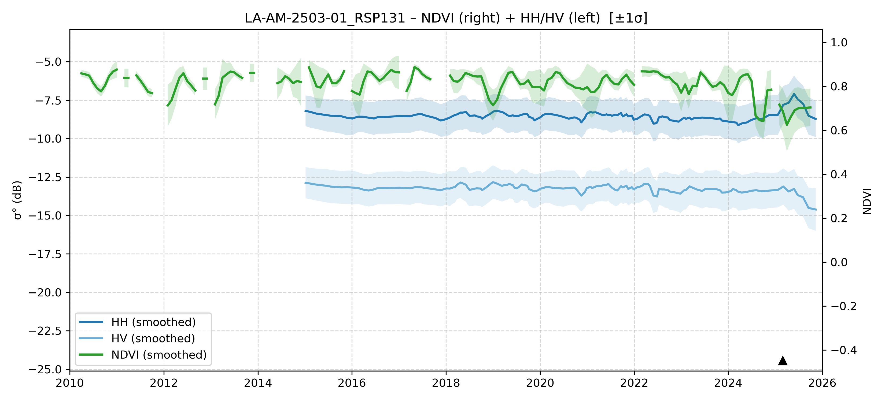

# LA-AM-2503-01 - FieldSurvey_20250309-15_RO_AC

| Title | Content |
|------|---------|
| ID | LA-AM-2503-01 |
| Survey Name | FieldSurvey_20250309-15_RO_AC |
| Mesh | S09W067 |
| State | AM |
| Lat, Lon | -66.75030217, -9.562686842 |
| Survey Date | 2025/3/12 |
| JJ-FAST v3.2 Date | 2021/1/3 |
| JJ-FAST v4.1 Date | 2025/6/24 |
| Deter Date | 2025/6/2 |
| Type | DES |
| NASA FIRMS Date |  |
| Prodes Year | Foerst |
| Embargo | 2025/5/24 |
| Obs |  |

---

## Survey Results 

---

## Map & Graph

（静的地図画像はまだ登録されていません）

---

## Comments

- 調査時の所感
- 現場の状況（伐採形態、森林状態など）
- 補足情報
