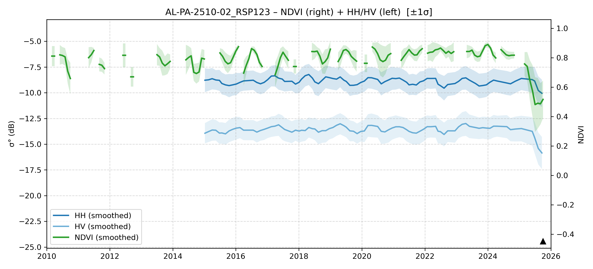

# AL-PA-2510-02 - FieldSurvey_20251006-16_PA

| Title | Content |
|------|---------|
| ID | AL-PA-2510-02 |
| Survey Name | FieldSurvey_20251006-16_PA |
| Mesh | S03W052 |
| State | PA |
| Lat, Lon | -51.73430801, -3.150419993 |
| Survey Date | 2025/10/13 |
| JJ-FAST v3.2 Date | 2025/8/7 |
| JJ-FAST v4.1 Date | N/A |
| Deter Date | NoData |
| Type | NoData |
| NASA FIRMS Date |  |
| Prodes Year | 2007 |
| Embargo | N/A |
| Obs |  |

---

## Survey Results 

---

## Map & Graph

（静的地図画像はまだ登録されていません）

---

## Comments

- 調査時の所感
- 現場の状況（伐採形態、森林状態など）
- 補足情報
