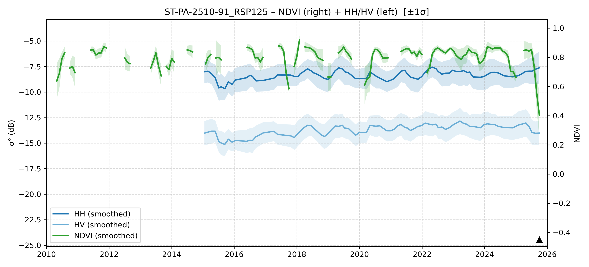

# ST-PA-2510-91 - FieldSurvey_20251006-16_PA

| Title | Content |
|------|---------|
| ID | ST-PA-2510-91 |
| Survey Name | FieldSurvey_20251006-16_PA |
| Mesh | S03W054 |
| State | PA |
| Lat, Lon | -53.23984894, -3.482058072 |
| Survey Date | 2025/10/22 |
| JJ-FAST v3.2 Date | 2025/7/1 |
| JJ-FAST v4.1 Date | N/A |
| Deter Date | N/A |
| Type | N/A |
| NASA FIRMS Date |  |
| Prodes Year | Foerst, 2007 |
| Embargo | 2025/10/28 |
| Obs |  |

---

## Survey Results 

---

## Map & Graph

（静的地図画像はまだ登録されていません）

---

## Comments

- 調査時の所感
- 現場の状況（伐採形態、森林状態など）
- 補足情報
