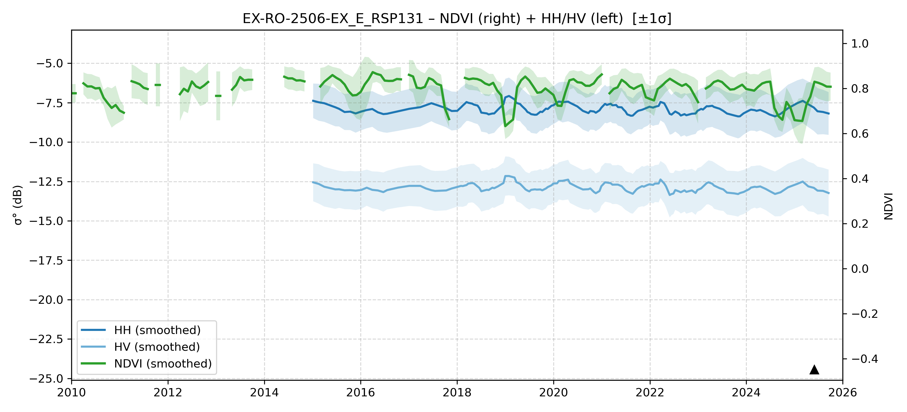

# EX-RO-2506-EX_E - MORI2_TestSurvey_20250531-0608_RO_AM

| Title | Content |
|------|---------|
| ID | EX-RO-2506-EX_E |
| Survey Name | MORI2_TestSurvey_20250531-0608_RO_AM |
| Mesh | S09W066 |
| State | RO |
| Lat, Lon | -65.57882192, -9.737285067 |
| Survey Date | 2025/6/3 |
| JJ-FAST v3.2 Date | N/A |
| JJ-FAST v4.1 Date | N/A |
| Deter Date | N/A |
| Type | N/A |
| NASA FIRMS Date |  |
| Prodes Year | Foerst |
| Embargo | 2025/2/25 |
| Obs |  |

---

## Survey Results 

---

## Map & Graph

（静的地図画像はまだ登録されていません）

---

## Comments

- 調査時の所感
- 現場の状況（伐採形態、森林状態など）
- 補足情報
