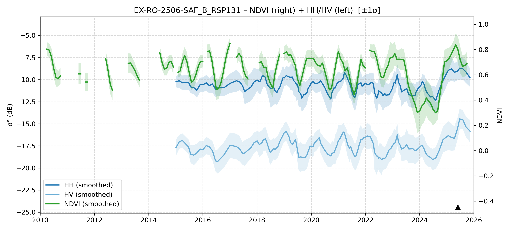

# EX-RO-2506-SAF_B - MORI2_TestSurvey_20250531-0608_RO_AM

| Title | Content |
|------|---------|
| ID | EX-RO-2506-SAF_B |
| Survey Name | MORI2_TestSurvey_20250531-0608_RO_AM |
| Mesh | S09W067 |
| State | RO |
| Lat, Lon | -66.56961483, -9.813724045 |
| Survey Date | 2025/6/2 |
| JJ-FAST v3.2 Date | NoData |
| JJ-FAST v4.1 Date | NoData |
| Deter Date | NoData |
| Type | NoData |
| NASA FIRMS Date |  |
| Prodes Year | 2007 |
| Embargo | N/A |
| Obs |  |

---

## Survey Results 

---

## Map & Graph

（静的地図画像はまだ登録されていません）

---

## Comments

- 調査時の所感
- 現場の状況（伐採形態、森林状態など）
- 補足情報
