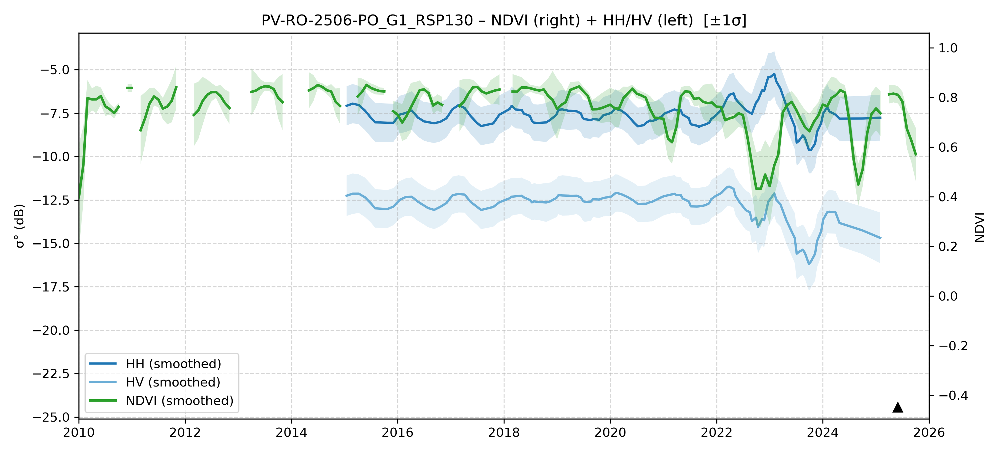

# PV-RO-2506-PO_G1 - MORI2_TestSurvey_20250531-0608_RO_AM

| Title | Content |
|------|---------|
| ID | PV-RO-2506-PO_G1 |
| Survey Name | MORI2_TestSurvey_20250531-0608_RO_AM |
| Mesh | S08W065 |
| State | RO |
| Lat, Lon | -64.39461651, -8.946810237 |
| Survey Date | 2025/6/4 |
| JJ-FAST v3.2 Date | 2022/9/20 |
| JJ-FAST v4.1 Date | 2022/3/31 |
| Deter Date | 2022/3/16 |
| Type | DES |
| NASA FIRMS Date |  |
| Prodes Year | 2022 |
| Embargo | 2023/5/10, 2023/5/12, 2023/6/19 |
| Obs |  |

---

## Survey Results 

---

## Map & Graph

（静的地図画像はまだ登録されていません）

---

## Comments

- 調査時の所感
- 現場の状況（伐採形態、森林状態など）
- 補足情報
